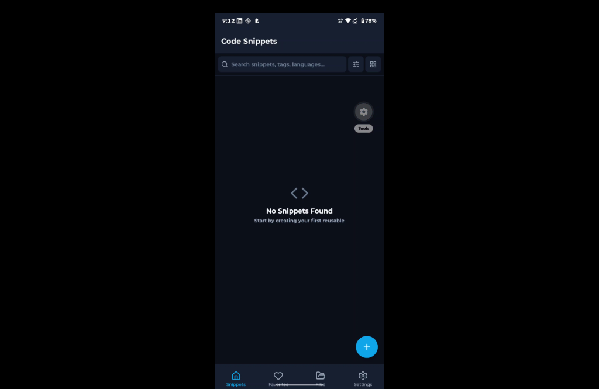
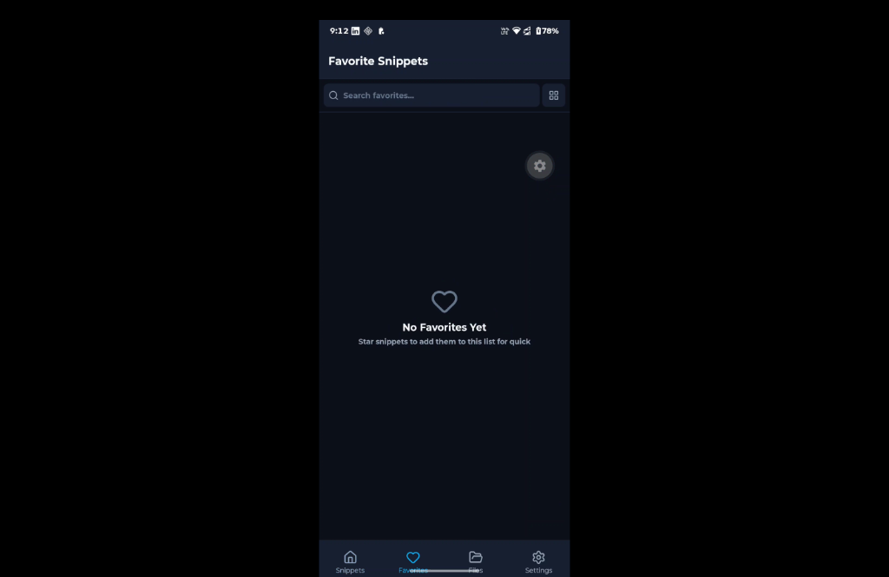
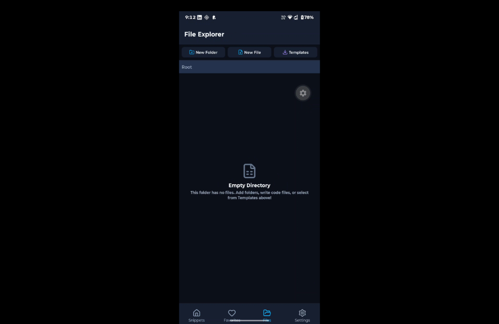
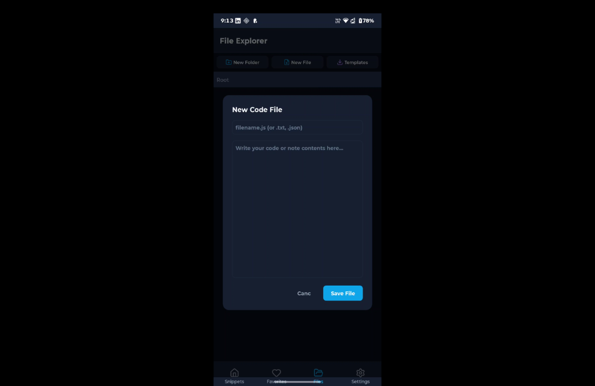
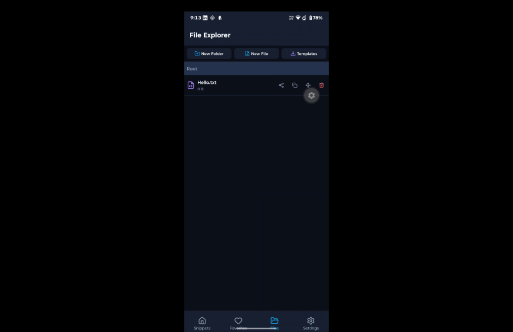
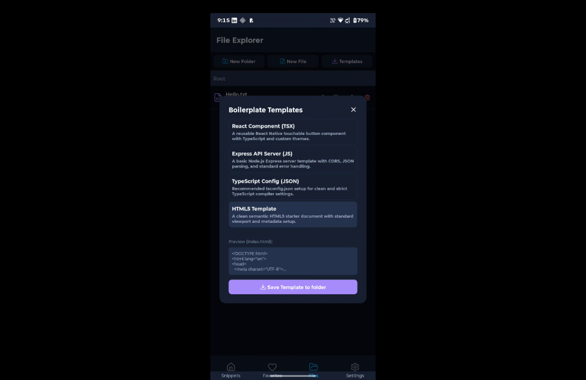
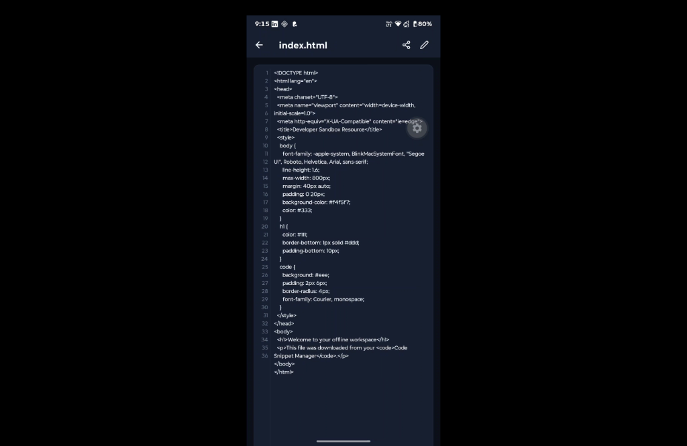
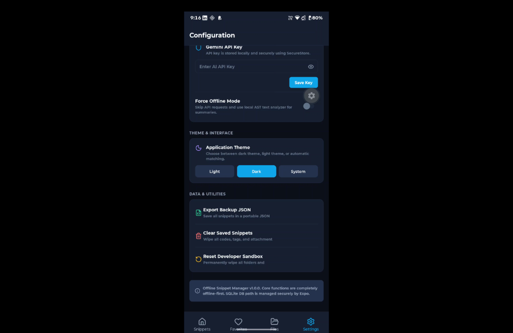
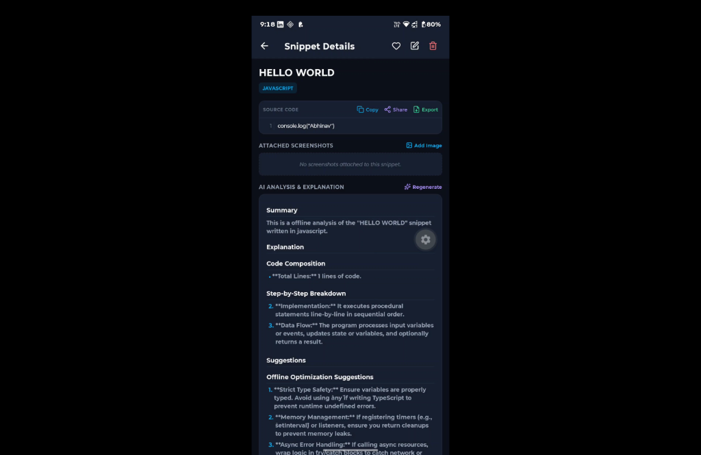

# DevSnippet
### Offline-First Code Snippet and Developer Resource Manager

DevSnippet is a modern, developer-focused mobile utility application built with Expo 55, React Native, and TypeScript. It follows a local-first, offline-ready architecture allowing developers to save, organize, search, and manage code snippets, local sandbox resources, and attachments completely on their device. It also includes an integrated AI code analyzer that functions both online (via Google Gemini) and offline (via a custom AST parser fallback).

Repository: [crazy-titan/Offline_app](https://github.com/crazy-titan/Offline_app)

---

## Core Features

### 1. Snippet Management
- **Full CRUD Operations**: Easily create, edit, view, and delete snippets.
- **Search and Filters**: Instantly query snippets by title, programming language, tags, or code content.
- **Organization**: Filter by specific language pills or dynamic tag clouds.
- **Favorites**: Star frequently used code blocks for quick access from the Favorites tab.

### 2. Offline-First Architecture
- All snippets, tag maps, and screenshot associations are stored in a local SQLite database on the device.
- The app operates fully without an active internet connection, guaranteeing zero-latency access to your saved code.

### 3. Sandboxed File Explorer
- Powered by Expo FileSystem, the app features a sandboxed workspace (dev_sandbox/).
- **File System Operations**: Create folders, write custom code or text files, delete, copy, or move items using an interactive select-destination interface.
- **In-App Code Editor**: View and modify file contents directly in a monospace line-numbered text input.
- **Screenshots Gallery**: Attach images (like screenshots) to snippets, store them in the sandboxed directory, and review them in a full-screen preview gallery.
- **Resource Templates**: Download standard pre-configured code structures (React Component, Express JS Server, TSConfig JSON, HTML5 template) straight to your folders.

### 4. AI-Powered Code Explainer
- Select any snippet to generate an analysis detailing a high-level Summary, step-by-step Explanation, and actionable Suggestions.
- **Secure Integration**: Configure your Google Gemini API Key in the Settings tab, securely saved via Expo SecureStore.
- **Offline Fallback**: If you have no internet connection or haven't configured an API key, a rule-based AST regex engine performs a localized analysis on your device instantly.

### 5. Native Sharing and Local Exports
- Export any code block into the sandboxed workspace as a .txt, .js (syntax formatted), or .json (full structured metadata) file.
- Share raw code sheets or export files directly with external messaging, mail, or cloud storage applications using Expo Sharing.

---

## Storage Architecture and Technology Stack

The application partitions data storage to prioritize security, speed, and privacy:

| Technology | Usage | Purpose |
| :--- | :--- | :--- |
| **SQLite** | Database | Persists the core snippet schemas, tag maps, and attachment file paths. |
| **Expo FileSystem** | Sandboxed Directories | Manages the custom folder trees, local code files, template assets, and snippet screenshots. |
| **SecureStore** | API Keys | Encrypts and stores credentials (like the Google Gemini API Key) on the device keychain. |
| **AsyncStorage** | App Settings | Saves non-sensitive configurations such as light/dark mode preference and grid/list layout selectors. |

---

## App Layouts and Screenshots

Here is the visual presentation of the DevSnippet user interface:

### 1. Snippets Dashboard and Favorites
<p float="left">
  
  
</p>

### 2. File Explorer and Sandbox Operations
<p float="left">
  
  
  
</p>

### 3. Template Downloader and Monospace Code Editor
<p float="left">
  
  
</p>

### 4. Settings Configuration and AI Code Explainer
<p float="left">
  
  
</p>

---

## Getting Started

### Prerequisites
- Node.js: ^20.19.4 or ^22.13.0
- npm or yarn

### Installation
1. Clone the repository:
   ```bash
   git clone git@github.com:crazy-titan/Offline_app.git
   cd Offline_app
   ```
2. Install dependencies:
   ```bash
   npm install --legacy-peer-deps
   ```
   *(Note: The --legacy-peer-deps flag ensures smooth peer dependency resolutions for React Native SVG and routing hooks in Expo 55).*

### Running the App
Start the Expo development server:
```bash
npm run start
```
- Press `a` for Android Emulator / Device.
- Press `i` for iOS Simulator / Device.
- Press `w` for Web Browser.
